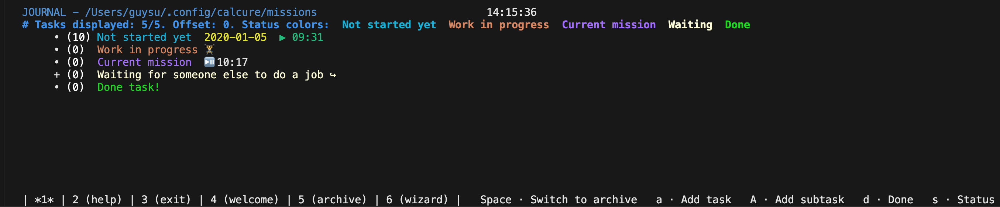

# Calcure


Modern TUI task manager with customizable interface. Manages your tasks



## Features

- Customizable icons
- Task archive
- Workspace manager - Supports as many task files as you wish
- Syncronize tasks over NFS (locking supported)
- Task features:
    - Running timer (play/pause/reset)
    - Extended information
    - Status (NOT_STARTED (default), WIP, CURRENT_MISSION, WAITING, DONE)
    - Importance
        - Undecided (default)
        - Optional - Can be deferred
        - Low - Nice to have
        - Medium - To do in the far future
        - High - To do in the near future
        - Critical - To do ASAP
    - Collapsable
    - Privacy-mode
- Filter tasks
- Scroll up/down with tasks
- Many movability features in the journal

## Installation

### Building from source
```bash
python3 setup.py install

# Now you can run:
python3 -m calcuresu
```
### Dependencies

- `python` 3.10 and higher (usually already installed)
- `windows-curses` on Windows
- `flufl.lock` - For NFS supported locking

## Usage

Run `calcuresu` in your terminal. You may need to restart your terminal after the install.

### Key bindings

Can view the bindings using the `?` key in the program.

### Settings

On the first run, calcuresu will create a `config.ini` file where you can edit parameters, colors, and icons at `~/.config/calcuresu/config.ini`
